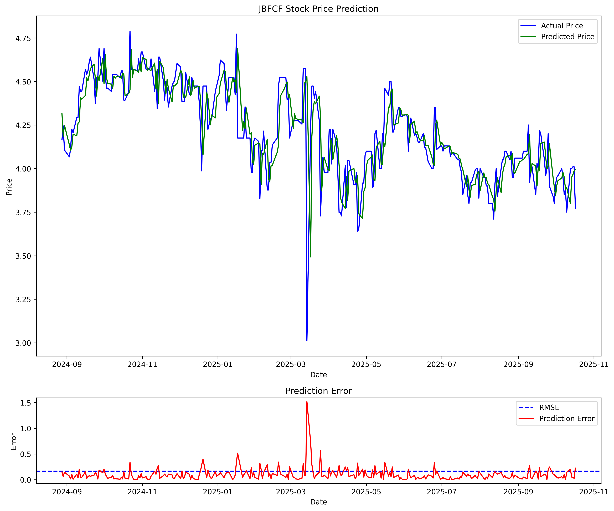

## JolliStock: Stock Predictor (JFC) by caecht and emilyts

A simple, notebook-driven project for exploring and predicting stock prices. The main workflow lives in `Main.ipynb`, and example output/visualization is included in `jfc_stock_prediction.png`.



---

### Features
- **Notebook-first workflow**: iterate quickly in `Main.ipynb`.
- **Reproducible environment**: use a local Python virtual environment.
- **Version-control friendly**: guidance for ignoring venv and notebook checkpoints; optional output-stripping for cleaner diffs.

---

### Project structure
- `Main.ipynb`: primary analysis and modeling notebook
- `jfc_stock_prediction.png`: example plot/result
- `.gitignore`: ignores `venv/`, `.ipynb_checkpoints/`, etc.

---

### Getting started

#### 1) Clone the repository
```bash
git clone <your-repo-url>.git
cd stockPredictorProj
```

#### 2) Create and activate a virtual environment
- Windows (PowerShell):
```powershell
python -m venv venv
venv\Scripts\Activate.ps1
```
- macOS/Linux (bash):
```bash
python3 -m venv venv
source venv/bin/activate
```

#### 3) Install dependencies
If a `requirements.txt` exists:
```bash
pip install -r requirements.txt
```
If not, open `Main.ipynb` and install packages as needed (e.g., `pandas`, `numpy`, `matplotlib`, `scikit-learn`, `yfinance`, etc.). Once stable, you can freeze dependencies for others:
```bash
pip freeze > requirements.txt
```

#### 4) Launch Jupyter and run the notebook
```bash
pip install jupyter
jupyter notebook
```
Open `Main.ipynb`, run cells from top to bottom, and adjust parameters as desired.

---

### Recommended Git settings for notebooks

- Ensure `venv/` and `.ipynb_checkpoints/` are ignored (already configured):
```gitignore
venv/
**/.ipynb_checkpoints/
```
- If these were committed before adding `.gitignore`, untrack them:
```bash
git rm -r --cached venv .ipynb_checkpoints
```
- To reduce noisy diffs from notebook outputs, install `nbstripout`:
```bash
pip install nbstripout
nbstripout --install --attributes .gitattributes
```
This adds a filter so `*.ipynb` outputs/metadata are stripped on commit.

- On Windows, consider normalizing line endings with a simple `.gitattributes`:
```gitattributes
* text=auto
```

---

### Reproducibility tips
- Record data sources (e.g., ticker, date range) inside the notebook.
- Set random seeds where applicable.
- Export final model artifacts or results if needed.

---

### Troubleshooting
- If the virtual environment doesn’t activate in PowerShell, ensure script execution is allowed:
```powershell
Set-ExecutionPolicy -Scope CurrentUser -ExecutionPolicy RemoteSigned
```
- If the kernel is missing in Jupyter after creating the venv:
```bash
pip install ipykernel
python -m ipykernel install --user --name=venv --display-name "Python (venv)"
```

---

### License
Specify your preferred license here (e.g., MIT). If omitted, this project is proprietary by default.

---

### Acknowledgements
- Built with Python and Jupyter.
- Thanks to the open-source community for libraries used in the notebook.